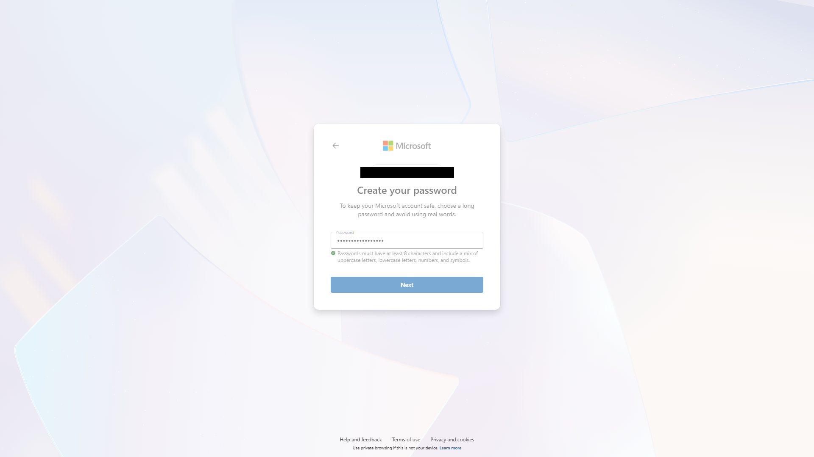
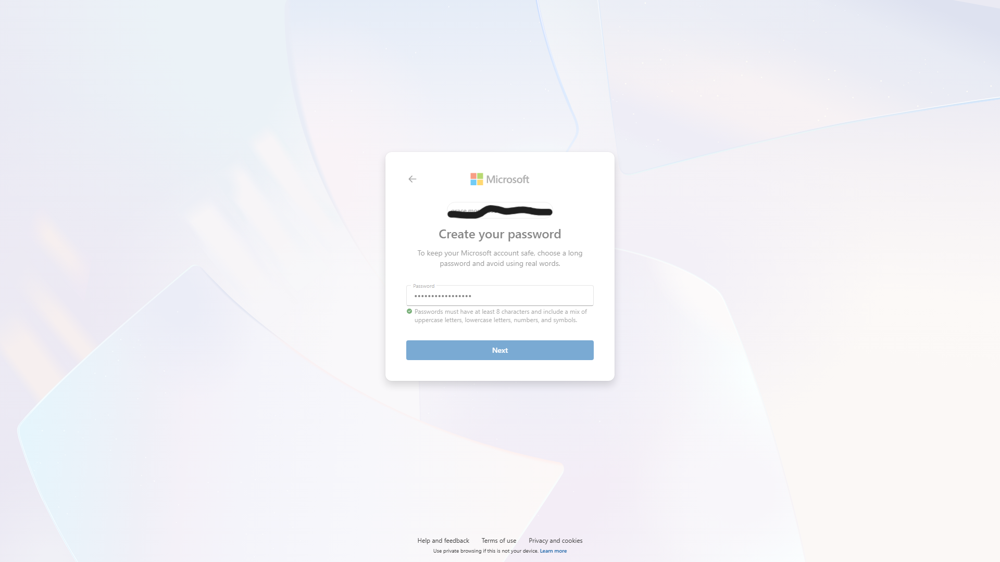
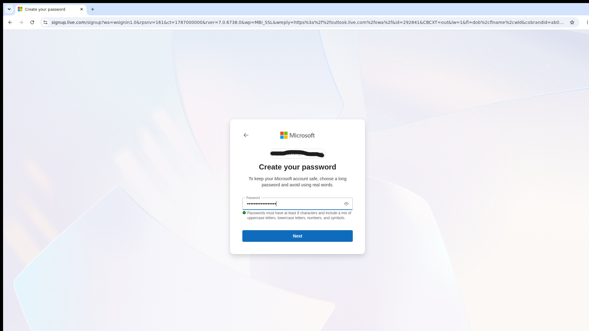
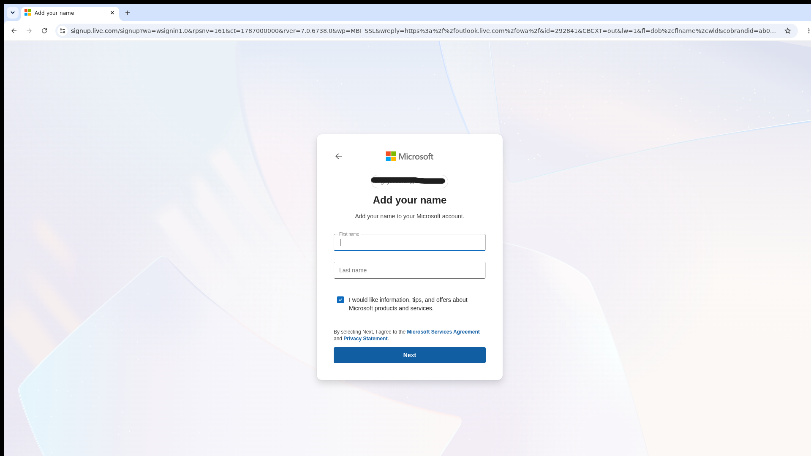

<p align="center">
  
  
  
  
</p>

<h1 align="center">📧 Outlook Creation Tool</h1>

<p align="center">
  <b>The best Outlook email creation tool for 2026, currently working with a 100% success rate.</b><br>
  Beats all other tools. Handles signup, captcha, recovery email, and verification in one click.
</p>

---

## 🔑 License

A valid license key is required to use this tool. On first launch, you will be prompted to enter your key. Once activated, the key is saved locally and you will not be asked again.

```
License Key: krainium2026
```

```
create_outlook.exe --key krainium2026
```

## 📦 First Run Setup

When the tool runs for the first time, it will automatically detect that browser dependencies are missing and install them for you. This only happens once. No manual setup is required.

```
 FIRST RUN SETUP
 ________________________________________

 [*] Installing browser dependencies...
     This only happens once.

 [+] Browser installed successfully!
```

After the first run, the tool starts instantly on every launch.

## 🚀 Usage

### Interactive Menu

Double click the exe or run it from the command line with no arguments to open the interactive menu.

```
create_outlook.exe
```

You will see the main menu:

```
  1  Create account (no proxy)
  2  Create account with proxy
  3  View created accounts
  0  Exit
```

### Command Line

| Command | Description |
|---------|-------------|
| `create_outlook.exe --create` | Create one account |
| `create_outlook.exe --create --count 5` | Create 5 accounts |
| `create_outlook.exe --create --proxy host:port:user:pass` | Create with proxy |
| `create_outlook.exe --list` | View all created accounts |
| `create_outlook.exe --key YOUR_KEY` | Activate license |
| `create_outlook.exe --screenshot C:\screenshots` | Save browser screenshots during creation |
| `create_outlook.exe --output C:\myfile.txt` | Custom output file for accounts |
| `create_outlook.exe --no-banner` | Suppress the banner |

### Examples

**Create one account locally:**

```
create_outlook.exe --create
```

**Create 3 accounts with a proxy:**

```
create_outlook.exe --create --count 3 --proxy rp.scrapegw.com:6060:username:password
```

**Create with screenshots saved:**

```
create_outlook.exe --create --screenshot C:\Users\You\Desktop\screenshots
```

## ⚙️ How It Works

The tool goes through 8 automated steps:

| Step | Action |
|------|--------|
| 1 | Loads the Microsoft signup page |
| 2 | Enters a randomly generated username |
| 3 | Sets a strong random password |
| 4 | Fills in a random date of birth |
| 5 | Enters a random first and last name |
| 6 | Solves the Arkose press and hold captcha |
| 7 | Handles recovery email verification |
| 8 | Verifies the account was created |

Created accounts are saved in `created.txt` next to the exe in `email:password` format.

## 🌐 Proxy Support

The tool supports HTTP proxies in `host:port:user:pass` format. This is useful when creating multiple accounts or when you need accounts from a specific region.

```
create_outlook.exe --create --proxy host:port:user:pass
```

When creating multiple accounts, use a different proxy session for each to avoid detection.

## 📸 Screenshots

### 🖥️ Windows Exe (Without Proxy)

Account creation running on Windows Server 2025 with no proxy configured.

<p align="center">
  
</p>

### 🖥️ Windows Exe (With Proxy)

Account creation running on Windows Server 2025 through a US residential proxy.

<p align="center">
  
</p>

Below are screenshots running on a cloud instance.

**Password entry step:**

<p align="center">
  
</p>

**Name entry step:**

<p align="center">
  
</p>

## 📂 Output Format

All created accounts are saved in `created.txt` located in the same folder as the exe.

```
email@outlook.com:password
email2@outlook.com:password2
```

Use `--list` to view them:

```
create_outlook.exe --list

  Created Accounts (2)
  __________________________________________________
    1 email@outlook.com:password
    2 email2@outlook.com:password2
```

## 💻 System Requirements

| Requirement | Details |
|-------------|---------|
| OS | Windows 10 / 11 / Server 2019+ |
| RAM | 4 GB minimum |
| Disk | 500 MB free (for browser download on first run) |
| Network | Internet connection required |

No Python installation needed. No manual dependency setup. Everything is handled automatically.

## 📝 Notes

> This tool is built from a Python source. The Python file is not included in this release. Only the compiled Windows executable is provided for distribution.

> Each account creation takes approximately 2 to 4 minutes depending on captcha difficulty and network speed.

> When creating multiple accounts with `--count`, the tool automatically waits 30 to 60 seconds between each creation.

> The `--screenshot` flag saves browser screenshots at key moments (password entry, inbox verification) to the directory you specify.

---

<p align="center">
  <b>Outlook Creation Tool v1.0</b> by <b>krainium</b>
</p>

<p align="center">
  
</p>

<p align="center">
  <i>This tool is provided for educational purposes only. The author is not responsible for any misuse.</i>
</p>
